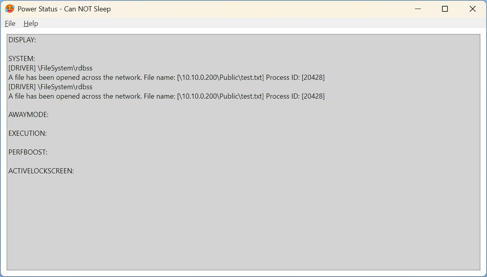

# Power Status

## Description
Power Status is a Windows desktop application that helps identify if any processes or applications are preventing the system from entering sleep mode.

The application provides a system tray icon to indicate the current power state:
- **Red icon** : Something is blocking the system from sleeping.
- **Yellow icon** : The system is ready to go to sleep.

Double-clicking the tray icon opens a detailed view, showing explicit information about what is preventing the system from sleeping.

NOTE: It may take a few seconds for the status to update, even if the blocking application has been closed.

## Features
- Real-time monitoring of system power requests.
- Visual indicators via tray icons.
- Detailed information about processes blocking sleep mode.
- Option to add or remove the application as a startup task.
- Lightweight and runs silently in the background.

## Installation
1. Download and run the executable file.
2. To permanently add the tray icon at startup:
   - Open the application.
   - Navigate to `File -> Add Startup Task` from the menu.

## License
This project is licensed under the [MIT License](LICENSE).

